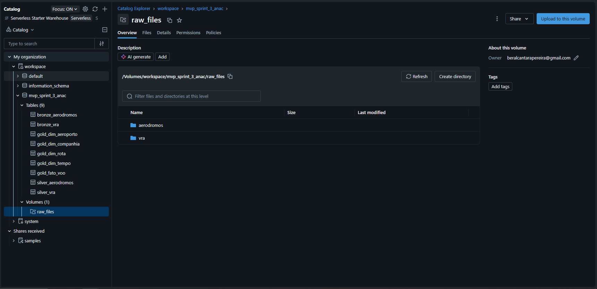
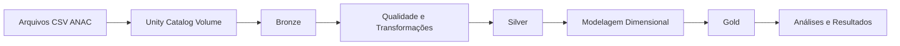
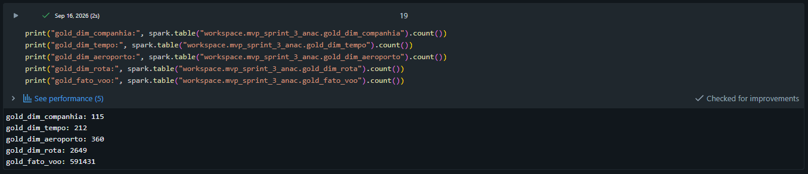
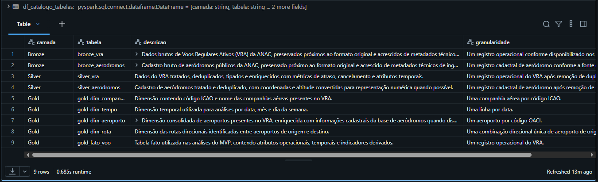
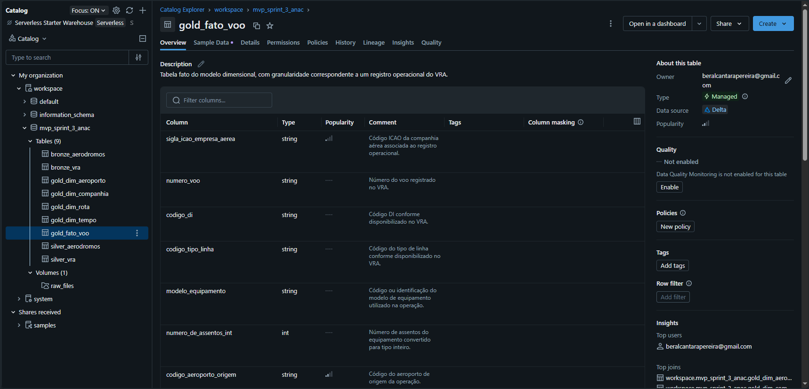
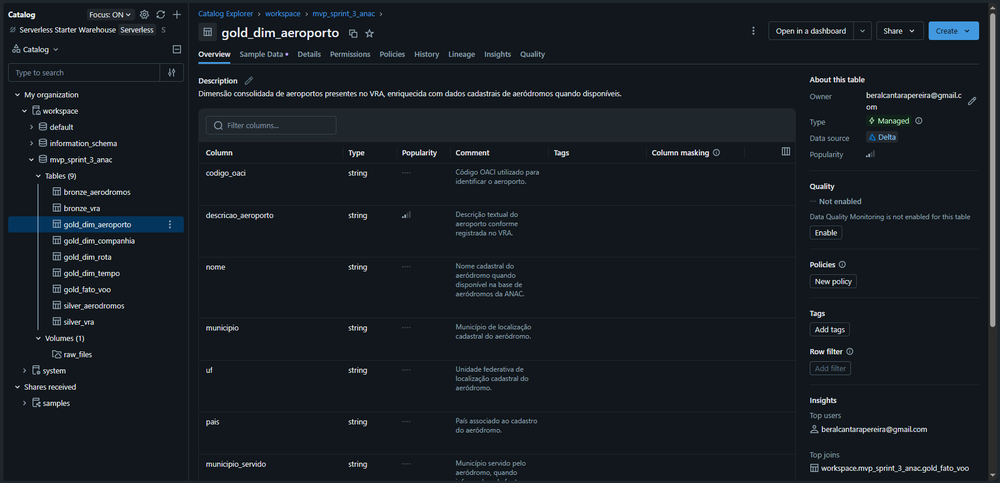
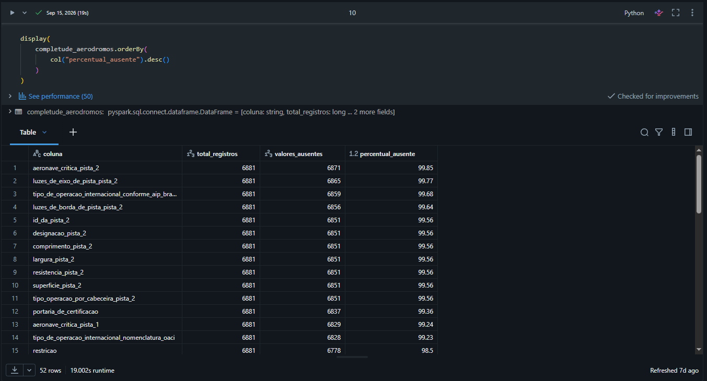
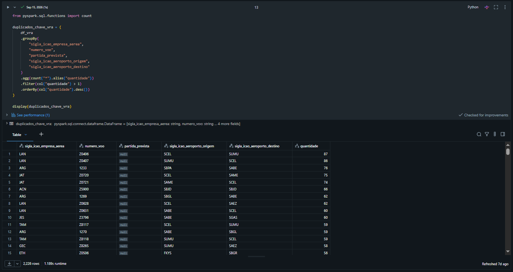
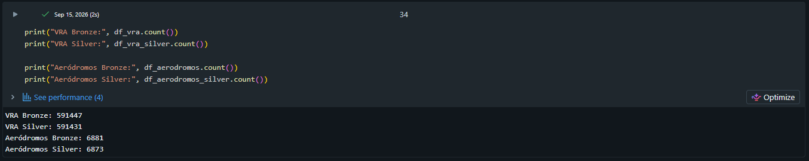

# MVP Sprint 3 — Engenharia de Dados
## Pipeline de Dados para Análise da Pontualidade e do Desempenho Operacional de Voos

**Autor:** Bernardo C. M. A. Pereira  
**Curso:** Especialização em Ciência de Dados e Analytics — PUC-Rio  
**Sprint:** Sprint 3 — Engenharia de Dados  
**Plataforma:** Databricks Free Edition  
**Tecnologias:** Apache Spark, PySpark, Delta Lake e Unity Catalog

---

## 1. Contexto de Negócios e Perguntas

A pontualidade e a regularidade das operações aéreas são indicadores relevantes para a avaliação do desempenho operacional do transporte aéreo. Atrasos e cancelamentos podem variar conforme aeroporto, companhia aérea, rota, período do dia e período do ano, tornando necessária uma estrutura de dados que permita consolidar, tratar e analisar essas informações de forma confiável.

Este MVP tem como objetivo construir um pipeline de dados ponta a ponta na nuvem, utilizando dados públicos da Agência Nacional de Aviação Civil (ANAC), com foco na análise de atrasos e cancelamentos de voos registrados entre janeiro e julho de 2026.

O projeto foi desenvolvido no Databricks seguindo a arquitetura Medalhão, com as camadas Bronze, Silver e Gold. A solução cobre ingestão, armazenamento, tratamento, qualidade, modelagem dimensional, catálogo de dados e análise.

As perguntas de negócio definidas para o projeto foram:

1. Quais aeroportos apresentam as maiores taxas de voos com atraso superior a 30 minutos e de cancelamentos?
2. Quais companhias aéreas apresentam os menores percentuais de atrasos superiores a 30 minutos e de cancelamentos?
3. Como a frequência e a duração dos atrasos variam conforme o dia da semana ou período do dia?
4. Quais rotas apresentam os maiores percentuais de atrasos e cancelamentos?
5. Como os indicadores de pontualidade e cancelamento evoluíram entre janeiro e julho de 2026?

As perguntas foram mantidas ao longo do desenvolvimento e orientaram a construção da camada analítica Gold.

---

## 2. Carga dos Dados

### 2.1 Fontes utilizadas

Foram utilizados dois conjuntos de dados públicos disponibilizados pela ANAC.

#### Voo Regular Ativo — VRA

O VRA reúne informações sobre voos planejados e realizados, incluindo horários previstos e realizados, aeroportos de origem e destino, companhia aérea e situação da operação.

Foram utilizados os arquivos mensais referentes ao período de janeiro a julho de 2026:

- `VRA_2026_01.csv`
- `VRA_2026_02.csv`
- `VRA_2026_03.csv`
- `VRA_2026_04.csv`
- `VRA_2026_05.csv`
- `VRA_2026_06.csv`
- `VRA_2026_07.csv`

Fonte oficial:  
https://www.anac.gov.br/acesso-a-informacao/dados-abertos/areas-de-atuacao/voos-e-operacoes-aereas/voo-regular-ativo-vra

#### Aeródromos Públicos — Características Gerais

Essa base contém informações cadastrais e operacionais de aeródromos públicos, incluindo código OACI, nome, município, UF, coordenadas, altitude e características de infraestrutura.

Arquivo utilizado:

- `pda_aerodromos_publicos_caracteristicas_gerais.csv`

Fonte oficial:  
https://www.anac.gov.br/acesso-a-informacao/dados-abertos/areas-de-atuacao/aerodromos/aerodromos-publicos-caracteristicas-gerais

Os dois conjuntos são disponibilizados pela ANAC em seu portal de Dados Abertos. Neste projeto, a fonte oficial é mantida explicitamente para garantir atribuição, rastreabilidade e reprodutibilidade. O uso dos dados deve respeitar os termos aplicáveis do portal da ANAC e do Governo Federal.

### 2.2 Armazenamento em nuvem

Os arquivos foram carregados no Databricks e armazenados em um Volume do Unity Catalog:

```text
/Volumes/workspace/mvp_sprint_3_anac/raw_files/
├── vra/
└── aerodromos/
```

Os arquivos originais foram preservados no Volume para garantir rastreabilidade e permitir reprocessamento do pipeline.



### 2.3 Camada Bronze

A camada Bronze preserva os dados o mais próximo possível de sua forma original.

Foram criadas duas tabelas Delta:

- `bronze_vra`: 591.447 registros;
- `bronze_aerodromos`: 6.881 registros.

Os campos foram inicialmente mantidos como texto, sempre que possível, e foram adicionados dois metadados técnicos:

- `arquivo_origem`: arquivo CSV de origem;
- `data_ingestao`: timestamp da ingestão.

Os nomes das colunas foram normalizados para `snake_case` para compatibilidade com as tabelas Delta, sem alteração do conteúdo semântico dos dados.

---

## 3. Modelagem e Catálogo de Dados

### 3.1 Arquitetura Medalhão

O pipeline foi estruturado nas camadas Bronze, Silver e Gold:



A camada Bronze mantém os dados brutos, a Silver concentra tratamentos e atributos derivados, e a Gold organiza os dados para consumo analítico.

### 3.2 Tabelas do pipeline

Foram persistidas nove tabelas no schema:

```text
workspace.mvp_sprint_3_anac
```

#### Bronze

- `bronze_vra`
- `bronze_aerodromos`

#### Silver

- `silver_vra`
- `silver_aerodromos`

#### Gold

- `gold_dim_companhia`
- `gold_dim_tempo`
- `gold_dim_aeroporto`
- `gold_dim_rota`
- `gold_fato_voo`


### 3.3 Modelo dimensional Gold

A camada Gold foi organizada em uma tabela fato e quatro dimensões.

#### `gold_fato_voo`

Granularidade: um registro operacional do VRA.

Principais atributos:

- companhia aérea;
- número do voo;
- aeroportos de origem e destino;
- horários previstos e realizados;
- atraso de partida e chegada em minutos;
- flags de atraso superior a 30 e 60 minutos;
- indicador de cancelamento;
- indicador de atraso extremo;
- período do dia;
- rota.

A tabela fato possui **591.431 registros**.

#### `gold_dim_companhia`

Dimensão com códigos ICAO e nomes das companhias aéreas.

- 115 companhias.

#### `gold_dim_tempo`

Dimensão utilizada nas análises temporais.

- 212 datas, cobrindo janeiro a julho de 2026.

#### `gold_dim_aeroporto`

Dimensão consolidada de aeroportos presentes no VRA e enriquecida com dados cadastrais dos aeródromos da ANAC quando existe correspondência.

- 360 aeroportos.

A mesma dimensão é utilizada nos papéis de aeroporto de origem e aeroporto de destino, caracterizando uma dimensão *role-playing*.

#### `gold_dim_rota`

Dimensão composta pelas combinações direcionais entre aeroporto de origem e destino.

- 2.649 rotas.

### 3.4 Integridade do modelo

Foram realizadas validações para verificar a correspondência entre a fato e as dimensões.

Os testes confirmaram:

- nenhuma companhia da fato sem correspondência na dimensão de companhias;
- nenhuma data da fato sem correspondência na dimensão temporal;
- nenhuma rota da fato sem correspondência na dimensão de rotas;
- manutenção dos 591.431 registros da Silver na tabela fato.



### 3.5 Catálogo de dados

Foi criado o notebook `05_catalogo_dados.ipynb` para documentar as tabelas e campos do pipeline.

O catálogo contém:

- camada;
- nome da tabela;
- descrição;
- granularidade;
- nome do campo;
- posição;
- tipo de dado;
- nulabilidade;
- descrição semântica;
- domínio ou regra;
- origem e transformação.

As descrições das tabelas Gold, dos campos Gold, dos principais campos derivados da Silver e dos metadados técnicos da Bronze também foram registradas diretamente no Unity Catalog.







A linhagem registrada pelo Databricks também permite visualizar a relação entre a tabela Silver, o notebook de modelagem, a tabela fato Gold e o notebook de análise.


---

## 4. Pipeline de Dados

O pipeline foi dividido em cinco notebooks.

### `01_ingestao_bronze.ipynb`

Responsável por:

- criação do schema e Volume;
- leitura dos arquivos CSV;
- preservação dos dados brutos;
- inclusão de metadados técnicos;
- criação das tabelas Delta da camada Bronze.

### `02_qualidade_silver.ipynb`

Responsável por:

- avaliação de qualidade;
- remoção de duplicatas exatas;
- conversão de tipos;
- tratamento tolerante de valores inválidos;
- criação das métricas de atraso;
- criação das flags de atraso e cancelamento;
- criação dos atributos temporais;
- conversão de coordenadas;
- persistência da camada Silver.

### `03_modelagem_gold.ipynb`

Responsável por:

- construção das dimensões;
- construção da tabela fato;
- criação da dimensão de rotas;
- enriquecimento dos aeroportos;
- validação de integridade;
- persistência da camada Gold.

### `04_analise.ipynb`

Responsável por:

- utilização das tabelas Gold;
- cálculo dos indicadores;
- aplicação dos critérios mínimos de volume;
- resposta às cinco perguntas de negócio;
- discussão dos resultados e limitações.

### `05_catalogo_dados.ipynb`

Responsável por:

- inventário das nove tabelas;
- documentação de schemas;
- descrição de granularidade;
- catálogo semântico;
- documentação de domínios e linhagem;
- registro de comentários no Unity Catalog.

A separação dos notebooks permite executar o pipeline em sequência:

```text
01_ingestao_bronze
        ↓
02_qualidade_silver
        ↓
03_modelagem_gold
        ↓
04_analise
        ↓
05_catalogo_dados
```

O catálogo é documental e pode ser executado após a construção das tabelas.

---

## 5. Qualidade de Dados

A avaliação de qualidade considerou completude, consistência, unicidade, acurácia e presença de valores extremos.

### 5.1 Completude

Foram verificadas ocorrências de valores nulos e strings vazias em todos os atributos.

Alguns campos apresentam alta ausência por característica da própria fonte. Por exemplo, campos como justificativa, codeshare e determinadas características cadastrais de aeródromos não são preenchidos em todos os registros.

Essas ausências não foram substituídas indiscriminadamente, pois um valor ausente pode representar informação não aplicável ou não fornecida, e não necessariamente erro.



### 5.2 Unicidade

Foram encontradas duplicatas exatas:

- VRA: 16 registros excedentes;
- Aeródromos: 8 registros excedentes.

Após a remoção das duplicatas exatas:

- `silver_vra`: 591.431 registros;
- `silver_aerodromos`: 6.873 registros.

Tentativas de utilizar chaves naturais mais restritas no VRA mostraram que registros com a mesma companhia, voo, data, origem e destino podem representar operações distintas por possuírem horários e classificações operacionais diferentes.

Por esse motivo, somente duplicatas exatas foram removidas.





### 5.3 Consistência e tipos

Os campos temporais foram convertidos para `timestamp`.

Também foram validados:

- domínios de `situacao_voo`;
- domínios de `situacao_partida`;
- domínios de `situacao_chegada`;
- códigos de tipo de linha;
- capacidade de conversão dos campos temporais;
- número de assentos;
- coordenadas e altitude dos aeródromos.

### 5.4 Integração entre VRA e aeródromos

Foi identificado que diversos códigos de aeroportos presentes no VRA não existem na base brasileira de aeródromos públicos utilizada para enriquecimento.

Isso não foi tratado automaticamente como erro, pois o VRA também contém operações envolvendo aeroportos internacionais.

Por isso, a dimensão Gold de aeroportos foi construída a partir de todos os códigos presentes no VRA, utilizando `left join` com o cadastro de aeródromos. Dessa forma, nenhum aeroporto existente nas operações foi eliminado por ausência de cadastro na segunda fonte.

### 5.5 Valores extremos

Foram avaliados atrasos e antecipações extremos.

Os critérios utilizados para inspeção foram:

- atraso superior a 600 minutos;
- antecipação superior a 180 minutos em módulo.

Foram encontrados 982 registros com atraso ou antecipação extremos em pelo menos uma das métricas avaliadas.

Esses registros não foram removidos automaticamente. A inspeção demonstrou que grande parte deles possui classificação operacional correspondente na própria fonte, como `Atraso > 240` ou `Antecipado`.

Foi criado o campo `flag_atraso_extremo` para permitir a identificação desses registros sem destruir informação potencialmente válida.

---

## 6. Análise de Dados

Os resultados completos estão disponíveis na pasta `resultados/` em arquivos CSV exportados a partir do Databricks.

### 6.1 Pergunta 1 — Aeroportos

**Quais aeroportos apresentam as maiores taxas de atrasos superiores a 30 minutos e de cancelamentos?**

Para o ranking de atrasos foram considerados aeroportos com pelo menos 500 voos com atraso calculável. Para cancelamentos foram considerados aeroportos com pelo menos 500 registros.

Maiores taxas de atraso superior a 30 minutos:

| Aeroporto | Taxa |
|---|---:|
| Miami — KMIA | 28,69% |
| Viru Viru — SLVR | 27,54% |
| Madrid-Barajas — LEMD | 25,74% |
| Lisboa — LPPT | 21,10% |
| Paris-Charles de Gaulle — LFPG | 19,72% |

Maiores taxas de cancelamento:

| Aeroporto | Taxa |
|---|---:|
| Punta Cana — MDPC | 66,76% |
| Murtala Muhammed/Lagos — DNMM | 56,29% |
| Hamad/Doha — OTHH | 43,14% |
| Madrid-Barajas — LEMD | 38,90% |
| Ezeiza/Buenos Aires — SAEZ | 30,53% |

Os resultados mostram que atraso e cancelamento representam dimensões distintas do desempenho operacional.

Arquivos:

- `resultados/pergunta_1_aeroportos_atraso.csv`
- `resultados/pergunta_1_aeroportos_cancelamento.csv`

### 6.2 Pergunta 2 — Companhias aéreas

**Quais companhias aéreas apresentam os menores percentuais de atrasos superiores a 30 minutos e de cancelamentos?**

Para atrasos foram consideradas companhias com pelo menos 500 voos com atraso calculável. Para cancelamentos foram consideradas empresas com pelo menos 500 registros.

Menores taxas de atraso superior a 30 minutos:

| Código ICAO | Taxa |
|---|---:|
| ABJ | 1,59% |
| CMP | 4,32% |
| GLO | 6,23% |
| SWR | 6,24% |
| BAW | 6,38% |

Menores taxas de cancelamento:

| Código ICAO | Taxa |
|---|---:|
| LAP | 0,53% |
| AFR | 0,65% |
| AVA | 0,68% |
| LAN | 0,70% |
| LPE | 0,73% |

A análise mostra que uma companhia pode apresentar baixa taxa de cancelamento sem necessariamente possuir a menor taxa de atrasos. Os indicadores foram, portanto, avaliados separadamente.

Arquivos:

- `resultados/pergunta_2_companhias_atraso.csv`
- `resultados/pergunta_2_companhias_cancelamento.csv`

### 6.3 Pergunta 3 — Dia da semana e período do dia

**Como a frequência e a duração dos atrasos variam conforme o dia da semana e o período do dia?**

A maior frequência de atrasos superiores a 30 minutos ocorreu nas quintas-feiras, com 10,25%, seguida por sexta-feira, com 9,98%, e quarta-feira, com 9,23%.

A duração dos atrasos apresentou comportamento diferente. Entre os voos com atraso superior a 30 minutos, domingo apresentou a maior média, com 109,78 minutos, seguido por sábado, com 101,99 minutos.

Por período do dia:

| Período | Taxa de atraso > 30 min |
|---|---:|
| Noite | 11,85% |
| Tarde | 9,21% |
| Madrugada | 8,18% |
| Manhã | 6,69% |

Apesar de apresentar frequência menor que a noite, a madrugada concentrou os atrasos mais longos, com média de 132,46 minutos e mediana de 60 minutos.

Arquivos:

- `resultados/pergunta_3_dia_semana.csv`
- `resultados/pergunta_3_periodo_dia.csv`

### 6.4 Pergunta 4 — Rotas

**Quais rotas apresentam os maiores percentuais de atrasos e cancelamentos?**

Para atraso foram consideradas rotas com pelo menos 200 voos com atraso calculável. Para cancelamento foram consideradas rotas com pelo menos 200 registros.

Maiores taxas de atraso superior a 30 minutos:

| Rota | Taxa |
|---|---:|
| SBGR → HAAB | 62,09% |
| CYYZ → SBGR | 39,83% |
| MDPC → SBGR | 35,59% |
| KORD → SBGR | 33,96% |
| KMIA → SBGL | 33,92% |

Também foram identificadas rotas com 100% dos registros cancelados no período analisado, entre elas:

- SAEZ → LEMD;
- SPJC → LEMD;
- LEMD → SPJC;
- SAEZ → MDPC;
- LEMD → SAEZ;
- MDPC → SAEZ.

Esses casos não possuem atraso calculável porque os voos cancelados não apresentam horário efetivamente realizado.

Arquivos:

- `resultados/pergunta_4_rotas_atraso.csv`
- `resultados/pergunta_4_rotas_cancelamento.csv`

### 6.5 Pergunta 5 — Evolução mensal

**Como os indicadores de pontualidade e cancelamento evoluíram entre janeiro e julho de 2026?**

| Mês | Atraso > 30 min | Cancelamento |
|---|---:|---:|
| Janeiro | 9,79% | 3,07% |
| Fevereiro | 9,42% | 2,99% |
| Março | 8,04% | 3,00% |
| Abril | 9,72% | 2,94% |
| Maio | 7,46% | 2,91% |
| Junho | 9,61% | 3,57% |
| Julho | 8,45% | 3,04% |

Não foi observada tendência contínua de melhora ou piora.

Maio apresentou os menores indicadores de atraso e cancelamento do período. Em junho houve aumento dos dois indicadores, enquanto julho apresentou nova redução da taxa de atrasos.

Arquivo:

- `resultados/pergunta_5_evolucao_mensal.csv`

### 6.6 Discussão geral

As análises mostram que o desempenho operacional varia de acordo com aeroporto, companhia aérea, rota e dimensão temporal.

Atraso e cancelamento não devem ser tratados como um único indicador. Um aeroporto, companhia ou rota pode apresentar baixa taxa de cancelamento e, ao mesmo tempo, maior incidência de atrasos entre os voos efetivamente realizados.

Também foi observado que frequência e duração dos atrasos não apresentam necessariamente o mesmo comportamento. O período noturno apresentou a maior frequência de atrasos superiores a 30 minutos, enquanto a madrugada apresentou a maior duração média entre os atrasos dessa magnitude.

A evolução mensal apresentou oscilações, sem tendência monotônica no período analisado.

Os resultados representam exclusivamente os dados disponíveis para janeiro a julho de 2026 e não devem ser interpretados como características permanentes das companhias, aeroportos ou rotas.

Além disso, os dados utilizados permitem identificar padrões e associações operacionais, mas não são suficientes para estabelecer relações causais sobre os motivos dos atrasos ou cancelamentos.

---

## 7. Autoavaliação

O MVP atingiu o objetivo de construir um pipeline de dados funcional em ambiente de nuvem utilizando Databricks, Spark, Delta Lake e Unity Catalog.

Entre os principais pontos positivos do desenvolvimento estão:

- construção de um pipeline ponta a ponta;
- preservação dos arquivos brutos e rastreabilidade da ingestão;
- adoção da arquitetura Medalhão;
- avaliação explícita de qualidade antes das transformações;
- preservação de valores extremos quando não havia evidência suficiente para classificá-los como erro;
- modelagem dimensional com tabela fato e dimensões;
- validações de integridade entre fato e dimensões;
- criação de catálogo técnico e semântico;
- registro de comentários diretamente no Unity Catalog;
- análise baseada em critérios mínimos de volume para evitar rankings dominados por grupos com poucas observações;
- separação conceitual entre atraso e cancelamento;
- disponibilização dos resultados analíticos também em CSV.

Como limitações, o conjunto de dados não possui informações suficientes para explicar causalmente os atrasos e cancelamentos. A base de aeródromos utilizada também não cobre todos os aeroportos internacionais presentes no VRA, exigindo a preservação dos códigos do VRA e enriquecimento somente quando existe correspondência cadastral.

Outra limitação é que o MVP utiliza um recorte temporal de janeiro a julho de 2026. Uma evolução futura natural seria ampliar a série histórica, avaliar sazonalidade em períodos maiores e incorporar outras fontes que permitam estudar fatores associados às ocorrências observadas.

Também poderiam ser adicionadas etapas de orquestração automática, testes de qualidade executados de forma programática a cada nova carga e atualização incremental das tabelas.

Considero que o projeto cumpriu o objetivo proposto para a Sprint ao demonstrar, de forma reproduzível, o ciclo completo de engenharia de dados: dados brutos → qualidade e transformação → modelagem → consumo analítico.

---

## Estrutura do Repositório

```text
.
├── README.md
├── notebooks/
│   ├── 01_ingestao_bronze.ipynb
│   ├── 02_qualidade_silver.ipynb
│   ├── 03_modelagem_gold.ipynb
│   ├── 04_analise.ipynb
│   └── 05_catalogo_dados.ipynb
├── resultados/
│   ├── pergunta_1_aeroportos_atraso.csv
│   ├── pergunta_1_aeroportos_cancelamento.csv
│   ├── pergunta_2_companhias_atraso.csv
│   ├── pergunta_2_companhias_cancelamento.csv
│   ├── pergunta_3_dia_semana.csv
│   ├── pergunta_3_periodo_dia.csv
│   ├── pergunta_4_rotas_atraso.csv
│   ├── pergunta_4_rotas_cancelamento.csv
│   └── pergunta_5_evolucao_mensal.csv
└── evidencias/
    ├── 01_volume_raw_files.png
    ├── 02_tabelas_schema.png
    ├── 03_catalogo_gold_fato_voo.png
    ├── 04_catalogo_gold_dim_aeroporto.png
    ├── 05_catalogo_resumo_tabelas.png
    ├── 06_qualidade_completude.png
    ├── 07_qualidade_duplicatas.png
    ├── 08_contagens_bronze_silver.png
    ├── 09_contagens_gold.png
    └── 19_lineage_gold_fato_voo.png
```

---

## Reprodução

Para reproduzir o projeto no Databricks:

1. criar ou utilizar um catálogo e schema com permissões de escrita;
2. criar um Volume para armazenamento dos arquivos brutos;
3. carregar os arquivos VRA mensais e o arquivo de aeródromos;
4. ajustar os caminhos do Volume no notebook `01_ingestao_bronze.ipynb`, caso seja utilizado outro catálogo ou schema;
5. executar os notebooks na seguinte ordem:

```text
01_ingestao_bronze.ipynb
02_qualidade_silver.ipynb
03_modelagem_gold.ipynb
04_analise.ipynb
05_catalogo_dados.ipynb
```

No desenvolvimento original foi utilizado:

```text
catalog: workspace
schema: mvp_sprint_3_anac
volume: raw_files
```

As tabelas são persistidas em formato Delta e podem ser consultadas novamente em execuções posteriores.

---

## Observações

Este projeto foi desenvolvido exclusivamente para fins acadêmicos como MVP da Sprint 3 — Engenharia de Dados da Especialização em Ciência de Dados e Analytics da PUC-Rio.

Os dados utilizados são provenientes da Agência Nacional de Aviação Civil — ANAC e permanecem sujeitos às condições de uso aplicáveis às fontes oficiais.
